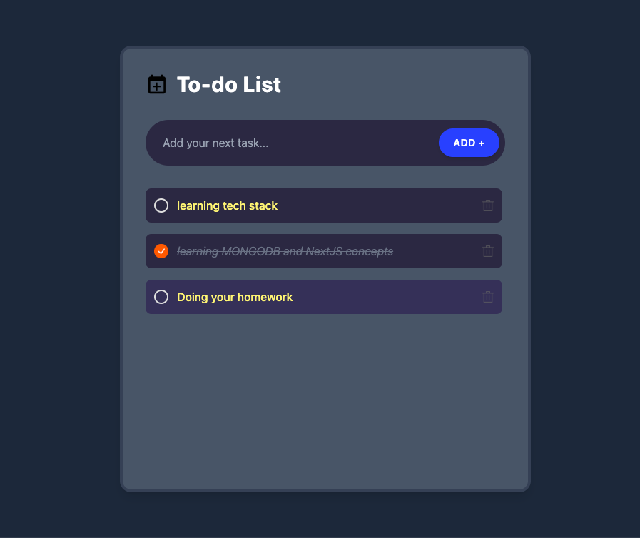

# To-Do App 📝

A **responsive React-based To-Do application** designed to help you manage tasks efficiently while learning core React concepts. The app features **sound effects**, persistent **local storage**, and a clean, modern UI.



## Features ✨
- **Add, edit, and delete tasks**  
- **Persistent storage** using local storage  
- **Sound effects** for task actions (add, delete, complete)  
- **Responsive design** for desktop and mobile  
- Built with **React.js** to practice components, state, and props  

## Tech Stack 🛠️
- **React.js** – Frontend library for building UI  
- **HTML5 & CSS3** – Structure and styling  
- **JavaScript** – Application logic  
- **LocalStorage API** – Save tasks persistently  
- **Sound effects** – Interactive task feedback  

## How to Run 🚀
1. Clone the repository:  
   ```bash
   git clone https://github.com/ATULJHAgh/ToDo-App.git
